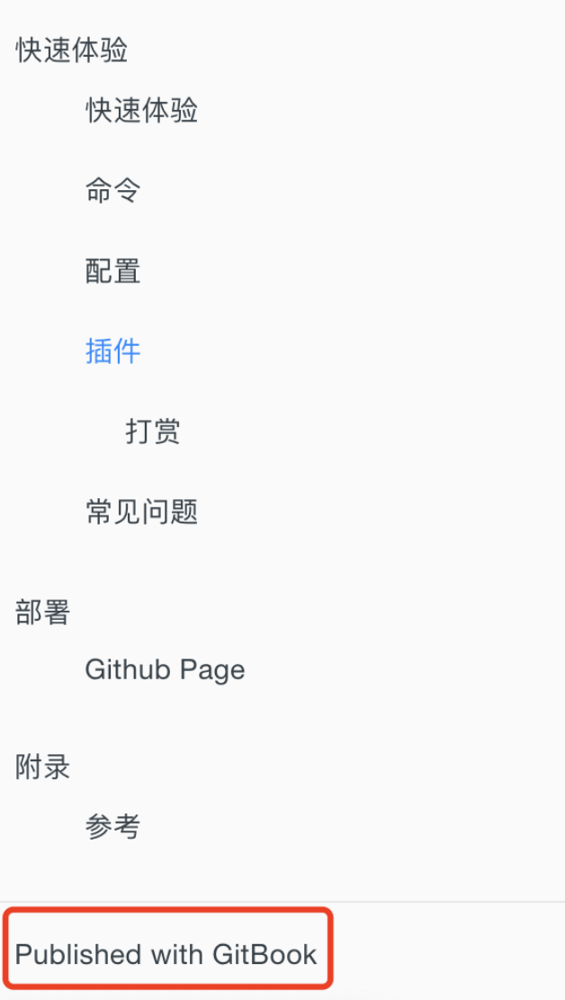

# 其他插件

### tbfed-pagefooter

在 book.json 中配置 tbfed-pagefooter 插件,详细说明请参考 tbfed-pagefooter 插件.

```json
{ 
    "plugins": ["tbfed-pagefooter"], 
    "pluginsConfig": { 
        "tbfed-pagefooter": { 
            "copyright":"&copy snowdreams1006", 
            "modify_label": "文件修订时间：", 
            "modify_format": "YYYY-MM-DD HH:mm:ss" 
        } 
    } 
}
```

### Splitter <a href="#splitter" id="splitter"></a>

侧边栏宽度可调节


### accordion

> 侧边栏折叠

<div align="left">

<figure><figcaption></figcaption></figure>

</div>


### expandable-chapters-small

配置

```
{
    "plugins": ["expandable-chapters-small"]
}  
```

说明：美化左侧导航栏的箭头，使其变小&#x20;

### sidebar-style

配置

```
{
    "plugins": ["sidebar-style"],
    "pluginsConfig": {
        "sidebar-style": {
            "title": "《Gitbook》",
            "author": "LPF"
        }
    }
}
```

说明：替换掉 `Published by GitBook` 提示信息


