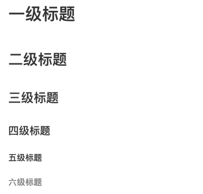
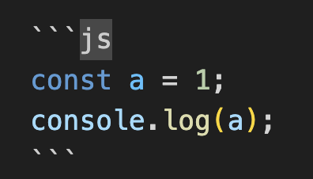

# Markdown语法入门

> markdown是一种非常简单的好用的写作语法，可以帮助我们快速实现文章的排版

## 标题

要创建标题，只需要在文本前加上1-6个井号`#`即可

```
# 一级标题
## 二级标题
### 三级标题
#### 四级标题
##### 五级标题
###### 六级标题
```
**实际展示：**



## 引用

```
> markdown是一种非常简单的好用的写作语法，可以帮助我们快速实现文章的排版
```

**实际展示：**


## 表格

```
|name|age|sex|
|---|---|---|
|zhangsan|10|男|
|lisi|22|女|
```

**实际展示：**

|name|age|sex|
|---|---|---|
|zhangsan|10|男|
|lisi|22|女|

## 列表

### 无序列表

```
- Dog
- Cat
- Pig
```
**实际展示：**

- Dog
- Cat
- Pig

### 有序列表

> 使用数字接着一个英文句点

```
1. Dog
2. Cat
3. Pig
```
**实际展示：**

1. Dog
2. Cat
3. Pig

## 代码

> 展示代码可以使用，一段代码使用```，一行代码使用一个点
> 三个点后可以选择显示的代码语言：js、bash、python、ruby等

### 代码片段



**实际展示：**

```js
const a = 1;
console.log(a);
```

### 一行代码

```
`markdown`
```

**实际展示：**

`markdown`

## 超链接
```
[markdown](https://taobao.com)
```
**实际展示：**

[markdown](https://taobao.com)

## 分割线

> 使用 3 个以上『-』符号制作分割线，例如：

```
文章第一部分
---
文章第二部分
```

**实际展示：**

文章第一部分

-----

文章第二部分

## 图片

```

```
**实际展示：**


## 斜体、加粗、删除

> 用*和_来表示斜体和加速，**表示加粗 __表示加粗

```
*这一段文字为斜体*
_这一段文字为加粗_
**这一段文字为斜体**
__这一段文字为加粗__
***这一段文字为斜体加粗***
___这一段文字为斜体加粗___
```

**实际展示：**

*这一段文字为斜体*

_这一段文字为加粗_

**这一段文字为加粗**

__这一段文字为加粗__

***这一段文字为斜体加粗***

___这一段文字为斜体加粗___

## 锚点

```
[滑动到markdown语法入门](#markdown语法入门)
```

[滑动到markdown语法入门](#markdown语法入门)